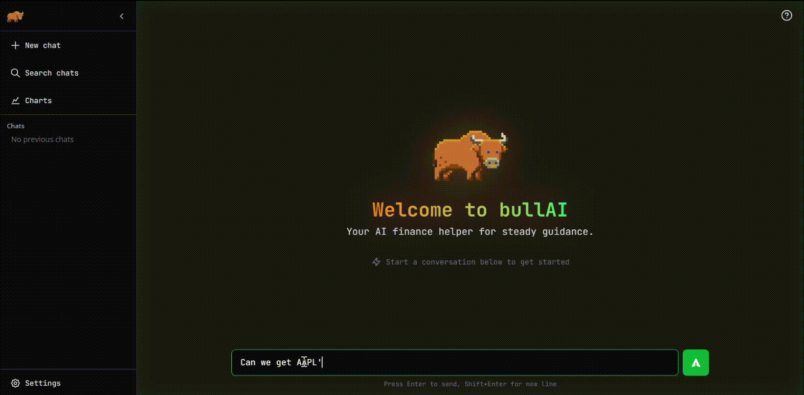

<p align="center">
  
</p>

# bullAI - Financial Assistant in Your Browser

<p align="center">
  
</p>

Bullish assistant in progress.

## Setup

### Prerequisites

- Install **[Node.js](https://nodejs.org/)** – for the frontend
- Install **[Python 3.12 or higher](https://www.python.org/downloads/)** – for the backend

### Run

1. Clone repository

   ```bash
   git clone https://github.com/zapulam/bullAI.git
   ```

2. Navigate to repository

   ```bash
   cd bullAI
   ```

3. One-time setup (install dependencies, create venv, etc.):

   ```bash
   python scripts/setup.py
   ```

4. Start the application:

   ```bash
   python scripts/start.py
   ```

## Tools

The AI assistant uses these tools to answer financial queries:

| Tool | Description |
| ------ | ------------- |
| `quote` | Get current price data of the global equity specified |
| `search` | Search for a ticker based on a keyword |
| `sentiment` | Fetch news sentiment for tickers and/or topics within a date range |
| `time_series_daily` | Get past 100 days of daily time series data + chart |
| `time_series_weekly` | Get past 100 weeks of weekly time series data + chart |
| `time_series_monthly` | Get past 100 months of monthly time series data + chart |

**Time series parameters:**

- `chart_type`: "simple" for line chart of close prices, "candlestick" for OHLC candlestick chart
- `screens`: Optional list of overlays: "sma", "ema", "wma" (premium key only)
- `time_periods`: Time period for each screen; length must match `screens`
